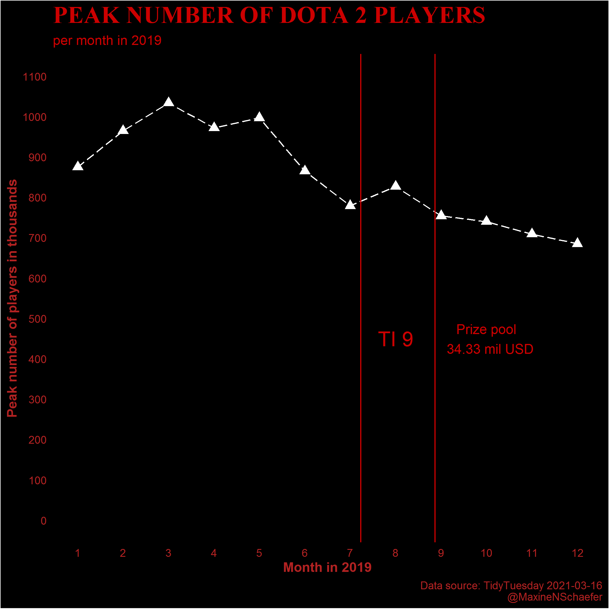

```{r setup, include=FALSE}
knitr::opts_chunk$set(echo = TRUE)
```

# Load libraries

```{r message = FALSE}
# library(tidytuesdayR) # only to initially download data
library(tidyverse)
library(ggdark) # for dark minimal theme
```


# Download and save data

```{r results = 'hide', message=FALSE}
# tuesdata <- tidytuesdayR::tt_load('2021-03-16')
# 
# dat <- tuesdata$games
# 
# write_csv(dat, "data.csv")

dat <- read_csv("data.csv")
```

# Check out the data

```{r}
View(dat)
skimr::skim(dat)
```

What I notice:
 
 * 1258 unique games `gamename`; need to convert to a factor
 * years range from 2012 - 2021 `year`; need to convert to a factor
 * `month` needs to be converted to a factor
 * from data dictionary
    + `avg` = average number of players at the same time
    + `peak` = most players at same time

# Convert some variables to factors

```{r}
dat <- dat %>% mutate(across(c(gamename, year), as_factor))
```

# Compare average number of players per month and year over time for Dota 2

```{r}
dat %>% filter(gamename == "Dota 2") %>%      # keep only Dota 2
  mutate(avg_in_thousands = round((avg/1000), 0 )) %>% # reduce numbers on the graph by dividing by 1000
  mutate(month = case_when(   # covert months to numbers so that the months are lsited correctly in the graph
    month == "January" ~ 1,
    month == "February" ~ 2,
    month == "March" ~ 3,
    month == "April" ~ 4,
    month == "May" ~ 5,
    month == "June" ~ 6,
    month == "July" ~ 7,
    month == "August" ~ 8,
    month == "September" ~ 9,
    month == "October" ~ 10,
    month == "November" ~ 11,
    month == "December" ~ 12
  )) %>% mutate(month = as.numeric(month)) %>% 
  ggplot(aes(x = month, y = avg_in_thousands)) + 
  geom_point() + facet_wrap(~year)

ggsave("avg-change-over-time.png")
```

This graphs shows that Dota 2 started off with fewer players in 2012, which increased to a peak in 2016 and has dropped slightly until 2021. 

# Compare peak number of players per month and year over time for Dota 2

```{r}
dat %>% filter(gamename == "Dota 2") %>%      # keep only Dota 2
  mutate(peak_in_thousands = round((peak/1000), 0 )) %>% # reduce numbers on the graph by dividing by 1000
  mutate(month = case_when(   # covert months to numbers so that the months are lsited correctly in the graph
    month == "January" ~ 1,
    month == "February" ~ 2,
    month == "March" ~ 3,
    month == "April" ~ 4,
    month == "May" ~ 5,
    month == "June" ~ 6,
    month == "July" ~ 7,
    month == "August" ~ 8,
    month == "September" ~ 9,
    month == "October" ~ 10,
    month == "November" ~ 11,
    month == "December" ~ 12
  )) %>% mutate(month = as.numeric(month)) %>% 
  ggplot(aes(x = month, y = peak_in_thousands)) + 
  geom_point() + facet_wrap(~year)

ggsave("peak-change-over-time.png")
```

# In a given year, are the peaks affected by Dota 2 related events such as The International?

First plot the peak values per month for 2019. I chose 2019 since this was the last 'normal' year we had, and I rememebr my husband, Mark, playing Dota 2 that year.

## Save data in a new object to make graph generation faster

```{r}
dat_graph <-  dat %>% 
  filter(gamename == "Dota 2", # keep only Dota 2
         year == 2019) %>%     # keep only year 2019  
  mutate(peak_in_thousands = round((peak/1000), 0 )) %>% # reduce numbers on the graph by dividing by 1000
  mutate(month = case_when(   # convert months to numbers so that the months are listed in order in the graph
    month == "January" ~ 1,
    month == "February" ~ 2,
    month == "March" ~ 3,
    month == "April" ~ 4,
    month == "May" ~ 5,
    month == "June" ~ 6,
    month == "July" ~ 7,
    month == "August" ~ 8,
    month == "September" ~ 9,
    month == "October" ~ 10,
    month == "November" ~ 11,
    month == "December" ~ 12
  )) %>% mutate(month = as.numeric(month))  # convert to numeric so that the months will be listed in order
``` 

## Make reasonable base graph

```{r}
p1 <- dat_graph %>% ggplot(aes(x = month, y = peak_in_thousands)) + 
  geom_point(shape = 17) + # add points
  geom_line(linetype = 5) + # add lines to join points
  theme_minimal() +  # add a minimal theme
  labs(x = "Month in 2019",  # add labels
       y = "Peak number of players",
       title = "Peak Number of Dota 2 Players",
       subtitle = "per month in 2019", 
       caption = "Data source: TidyTuesday 2021-03-16
       @MaxineNSchaefer") +
  scale_x_continuous(n.breaks = 12)  # have a break for each month

p1  
ggsave("p1.png")
```

## Add data for International 2019

The International in 2019 began on 7 July and the final was on 26 August. Add these dates using `vline()`.

First create a dataframe with the TI data.

```{r}
TIstart <- (7/30) + 7
TIend <- (26/30) + 8
```

Add TI start and end to graph.

```{r}
p1 +
  geom_vline(xintercept = TIstart, color = "#982f1f") + # add start date and color using Dota 2 colour
  geom_vline(xintercept = TIend, color = "#982f1f") + # add end date and color using Dota 2 colour
  annotate(geom="text", x=8, y=900, label="TI 9",
              color="#982f1f")
  
```

# Make a prettier vis

Dota 2 as a game is quite dark. Redo the graph with a dark background and light elements. 

## New base graph

```{r}
# data to work with
dat_graph <-  dat %>% 
  filter(gamename == "Dota 2", # keep only Dota 2
         year == 2019) %>%     # keep only year 2019  
  mutate(peak_in_thousands = round((peak/1000), 0 )) %>% # reduce numbers on the graph by dividing by 1000
  mutate(month = case_when(   # convert months to numbers so that the months are listed in order in the graph
    month == "January" ~ 1,
    month == "February" ~ 2,
    month == "March" ~ 3,
    month == "April" ~ 4,
    month == "May" ~ 5,
    month == "June" ~ 6,
    month == "July" ~ 7,
    month == "August" ~ 8,
    month == "September" ~ 9,
    month == "October" ~ 10,
    month == "November" ~ 11,
    month == "December" ~ 12
  )) %>% mutate(month = as.numeric(month))  # convert to numeric so that the months will be listed in order

# TI start and end
TIstart <- (7/30) + 7
TIend <- (26/30) + 8

# base graph
p2 <- dat_graph %>% ggplot(aes(x = month, y = peak_in_thousands)) + 
  geom_point(shape = 17, size = 3) + # add points
  geom_line(linetype = 5) + # add lines to join points
  labs(x = "Month in 2019",  # add labels
       y = "Peak number of players in thousands",
       title = "PEAK NUMBER OF DOTA 2 PLAYERS",
       subtitle = "per month in 2019", 
       caption = "Data source: TidyTuesday 2021-03-16
       @MaxineNSchaefer") +
  scale_x_continuous(n.breaks = 12) + # have a break for each month
  scale_y_continuous(limits = c(0, 1100), breaks = c(0, 100, 200, 300, 400, 500, 600, 700, 800, 900, 1000, 1100)) +
  geom_vline(xintercept = TIstart, color = "#cc0000") + # add start date and color using Dota 2 colour
  geom_vline(xintercept = TIend, color = "#cc0000") + # add end date and color using Dota 2 colour
  annotate(geom="text", x=8, y=450, label="TI 9", color="#cc0000", size = 6) # add text to graph
  
p2 
ggsave("p2.png")
```

## Make graph darker

```{r}
p3 <- p2 + dark_theme_minimal() + # add basic dark theme
  
  # edit theme to match Dota 2 colours more or less
  theme(axis.title = element_text(colour = "#b22222", face = "bold"),
        plot.title = element_text(size = 20, colour = "#cc0000", face = "bold", family = "serif"),
        plot.subtitle = element_text(colour = "#cc0000"),
        plot.caption = element_text(colour = "#b22222"),
        axis.text = element_text(colour = "#b22222"),
        panel.grid.major = element_blank(), # remove grid lines
        panel.grid.minor = element_blank()) +  # remove grid lines
  
  annotate(geom="text", x=10, y=450, label= # add text to indicate prize pool value
  "Prize pool
  34.33 mil USD", color="#cc0000", size = 4)
  
p3
```

# Save the output

```{r}
ggsave("dotaplot.png")
```

# All the code in one place

```{r message = FALSE, eval = FALSE}
# libraries
library(tidytuesdayR) # only to initially download data
library(tidyverse)
library(ggdark) # for dark minimal theme

# Download and save data
tuesdata <- tidytuesdayR::tt_load('2021-03-16')
dat <- tuesdata$games

# Check out the data
View(dat)
skimr::skim(dat)

# TI start and end
TIstart <- (7/30) + 7
TIend <- (26/30) + 8

# Generate graph

p_final <- 
  
  # get data ready
 dat %>% 
  
  # filter data to include only Dota 2 for 2019
  filter(gamename == "Dota 2", # keep only Dota 2
         year == 2019) %>%     # keep only year 2019
  
  # make axis more readable
  mutate(peak_in_thousands = round((peak/1000), 0 )) %>% # reduce numbers on the graph by dividing by 1000
  
  # convert months to numbers so that the months are listed in order in the graph
  mutate(month = case_when(   
    month == "January" ~ 1,
    month == "February" ~ 2,
    month == "March" ~ 3,
    month == "April" ~ 4,
    month == "May" ~ 5,
    month == "June" ~ 6,
    month == "July" ~ 7,
    month == "August" ~ 8,
    month == "September" ~ 9,
    month == "October" ~ 10,
    month == "November" ~ 11,
    month == "December" ~ 12
  )) %>% mutate(month = as.numeric(month)) %>%  # convert to numeric so that the months will be listed in order


# base graph
 ggplot(aes(x = month, y = peak_in_thousands)) + 
  geom_point(shape = 17, size = 3) + # add points
  geom_line(linetype = 5) + # add lines to join points
  
  # add labels
  labs(x = "Month in 2019",  
       y = "Peak number of players in thousands",
       title = "PEAK NUMBER OF DOTA 2 PLAYERS",
       subtitle = "per month in 2019", 
       caption = "Data source: TidyTuesday 2021-03-16
       @MaxineNSchaefer") +
  
  # fix axis breaks and limits
  scale_x_continuous(n.breaks = 12) + # have a break for each month
  scale_y_continuous(limits = c(0, 1100), breaks = c(0, 100, 200, 300, 400, 500, 600, 700, 800, 900, 1000, 1100)) + # start at 0
  
  # add start and end dates of The International which I got from https://liquipedia.net/dota2/The_International/2019#Viewership_Stats
  geom_vline(xintercept = TIstart, color = "#cc0000") + # add start date and color using Dota 2 colour
  geom_vline(xintercept = TIend, color = "#cc0000") + # add end date and color using Dota 2 colour
  
    # add label for TI, and prize pool
  annotate(geom="text", x=8, y=450, label="TI 9", color="#cc0000", size = 6) + # add text to graph 
  annotate(geom="text", x=10, y=450, label= # add text to indicate prize pool value
  "Prize pool
  34.33 mil USD", color="#cc0000", size = 4) +
  
  # edit theme
dark_theme_minimal() + # add basic dark theme from {ggdark}
  
  # edit theme to match Dota 2 colours more or less
  theme(axis.title = element_text(colour = "#b22222", face = "bold"),
        plot.title = element_text(size = 20, colour = "#cc0000", face = "bold", family = "serif"), #change the font for the title
        plot.subtitle = element_text(colour = "#cc0000"),
        plot.caption = element_text(colour = "#b22222"),
        axis.text = element_text(colour = "#b22222"),
        panel.grid.major = element_blank(), # remove grid lines
        panel.grid.minor = element_blank())  # remove grid lines

p_final
# ggsave("final_plot.png")
```


